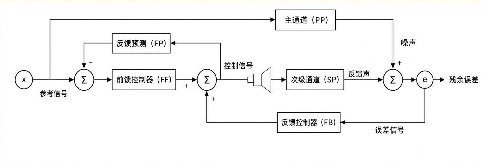
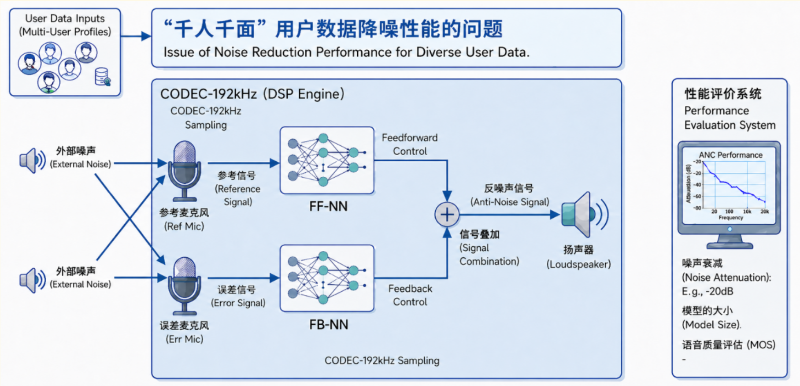

# 竞赛试题 · 赛题二：主动降噪

> 本文档由 `CCF-赛题2.png` 图片内容转录整理而成，保持原文表述。

## 1. 赛题背景

前馈与反馈相结合的混合主动降噪模式，已在主动降噪领域得到广泛应用。随着应用场景日益复杂、噪声类型更加多样，传统降噪方法在适应性和稳定性方面面临新的挑战。因此，面向复杂场景和多样化噪声样本，发展自适应降噪与 AI 降噪技术，有助于进一步提升主动降噪系统的综合性能和用户体验。

## 2. 赛题内容

（1）基于对主动噪声控制（ANC）系统原理的理解，采用 AI 方法**设计轻量级神经网络**，实现**端到端的主动降噪控制**，在保证模型计算效率和部署可行性的基础上，尽可能提升系统的降噪效果。

（2）在实际应用中，主动噪声控制系统的传递函数会受到环境变化的显著影响。例如，在主动降噪耳机中，不同佩戴者的耳道结构、佩戴松紧程度以及耳机位置变化，都会导致声学传递函数发生较大变化，从而影响降噪效果。因此，本研究希望参赛者设计的 AI 模型不仅能够在特定环境下实现良好的降噪性能，还应**具备较强的泛化能力**，能够适应不同的 ANC 声学环境。需要特别说明的是，所部署的模型必须采用**离线推断方式工作**，即模型在实际运行过程中不允许进行在线训练和在线参数更新。

### 图 1：ANC 简化架构示意图

### 图 2：AI-ANC 实现框架示意图

## 3. 数据集与基线系统

竞赛方将提供如下数据：

- **原始参考噪声**：麦克风采集的原始环境噪声（16-bit WAV，原生 48kHz）。
- **期望噪声**：噪声经过未知初级路径衰减后到达误差麦克风的声音。
- **次级路径**：扬声器到误差麦克风的物理冲激响应（已做空间平均并降采样至 48kHz）。

> 训练集

竞赛组织方将提供一个基线模型及其完整的训练和推理代码，鼓励复现我们公布的 baseline 的结果。

- Baseline: <https://github.com/CCF2026ANC/CCF_DEEPANC_2026>

## 4. 关键交附件

**初赛**

- 参赛队伍提供可执行的模型文件，在赛事官方指定环境中进行测试。
- 参赛队伍需提交方案复杂度和可实现性的文档，文档包括模型运行输出的日志文件、数据说明、参数量、以及复杂度和说明文档。

**复赛**

- 最终方案的技术报告和答辩材料（含算法原理、方案设计、创新性、各个模型对结果的作用分析等）。

## 5. 评分规则

- **初赛**：组委会通过业界常用客观评测方案对参赛队伍结果进行客观评分，排序取前 7 名进入决赛；所有队伍需要提供可执行模型。
- **复赛**：算法处理结果占比 40%；方案创新性（如 ANC 架构、自适应算法、先进滤波器结构等）占比 30%；方案的复杂度和可实现性占比 30%。

### 评分指标表

| 一级指标 | 二级指标 | 要求 | 对应分值 |
| --- | --- | --- | --- |
| 客观打分 | 客观指标 | 按照 50-5kHz 的 1/3 倍频程统计 ANC 降噪量，占比 70%，根据初赛所有参赛队伍实际提交结果划分客观打分等级 | 28 |
| 客观打分 | 客观指标 | 按照 1k-8kHz 的 1/3 倍频程统计 ANC 反弹，占比 30%，根据初赛所有参赛队伍实际提交结果划分客观打分等级 | 12 |
| 客观打分 | 复杂度 | 重点考察算法的参数量（M）和复杂度（MFlops），占比 2/3。 **参数量**：< 5M：10 分；5M~10M：8 分；10M~15M：6 分；15M~20M：5 分；>20M：4 分。 **复杂度**：< 500MFlops：10 分；500~2000MFlops：8 分；2000~5000MFlops：6 分；5000~10000MFlops：5 分；>10000MFlops：4 分。 | 20 |
| 主观打分 | 方案创新性 | 在算法原理或者方案实践上有原创性进展；20~30 分；在算法原理或者方案实践上基于现有方法有优化；0~20 分。 | 30 |
| 主观打分 | 听感评估（MOS） | 对音频进行 Overall MOS 评分，并对所有结果进行排序，分为四级，评分如下：1 级 10 分，2 级 8 分，3 级 6 分，4 级 4 分。 | 10 |
